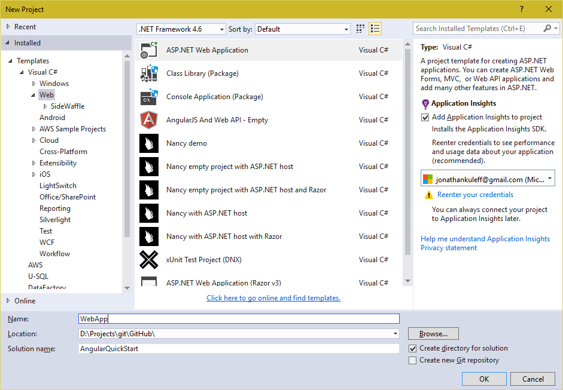
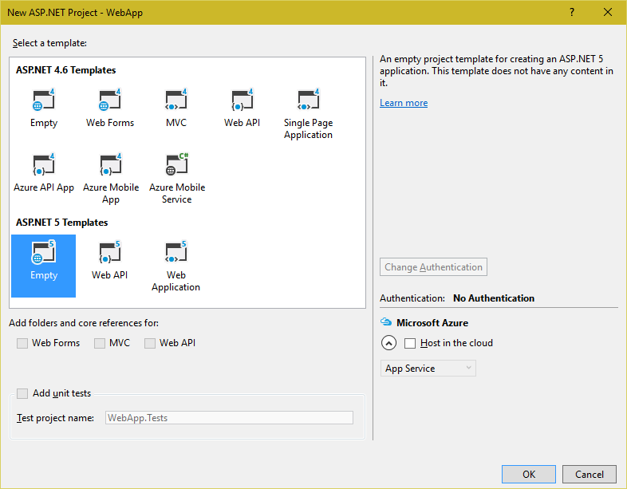
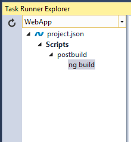

# Angular 2 (rc1) Tour of Heroes using ngrx, Angular Cli and ASP.NET 5 in Visual Studio 2015

This repository aims to implement the [Angular 2 Tour of Heroes Tutorial](https://angular.io/docs/ts/latest/tutorial/)
using the [Angular Cli](https://github.com/angular/angular-cli), [ngrx/store](https://github.com/ngrx/store),
[ngrx/router](https://github.com/ngrx/router) and [ASP.NET 5](https://docs.asp.net/en/latest/) in Visual Studio 2015.

## Perequisite

I'm using:

* Visual Studio 2015 Community Update 2
* [ASP.NET and Web Tools 2015 (RC1 Update 1)](https://docs.asp.net/en/latest/getting-started/installing-on-windows.html#install-asp-net-5-with-visual-studio)
* [ASP.NET 5 Scripts Task Runner](https://visualstudiogallery.msdn.microsoft.com/9397a2da-c93a-419c-8408-4e9af30d4e36)
* Typescript 1.8.30.0
* Typings 0.8.1
* NPM 3.8.8
* Angular Cli 0.1.0

Visual Studio 2015 includes its own version of external tools, unfortunately these tools have not been updated causing errors with some required packages.
To fix this we are going to force Visual Studio to use our global installs of node and npm.
Follow the instructions in the follow blog - [Customize external web tools in visual studio 2015](https://blogs.msdn.microsoft.com/webdev/2015/03/19/customize-external-web-tools-in-visual-studio-2015/).

### Setting up ASP.NET Core RC1

1. Follow instructions to [Install ASP.NET 5 on Windows](https://docs.asp.net/en/1.0.0-rc1/getting-started/installing-on-windows.html)

1. Upgrade to latest framework, in command prompt

    ```powershell
    > dnvm upgrade latest -r clr -arch x64
    ```

## Getting Started

### Step 1. Create an empty ASP.NET Core project

1. Open Visual Studio 2015 and click *New Project...* on Start Page.

1. Create a new ***ASP.NET Web Application***
    

1. Select ***Empty*** from *ASP.NET 5 Templates*
    

### Step 2. Setup Angular 2 in the project

1. Open an elevated command prompt at the project folder, i.e. *{solution}/src/{project}*

1. Initalise Angular by running the following angular-cli command

    ```cmd
    > ng init --name toh --prefix toh --source-dir clientSrc
    ```
    > Here we are calling our angular app toh (tour of heroes). We are also saying we want to default our
    > components with toh and that the app source folder should be clientSrc instead of src

1. ASP.NET Core expects our static files to be placed in ***wwwroot/*** however by default the angular cli will output to *dist/*.
  To fix this add a new ***JSON File*** to the project's root folder called ***.ember-cli*** and copy/paste the following:

    ```json
    {
        "output-path": "wwwroot/"
    }
    ```
    > In future versions this will probably be move into angular-cli.json

### Step 3. Configure Typescript

1. Copy/paste the following into ***tsconfig.json*** in *clientSrc/*

    ```json
    {
        "compileOnSave": true,
        "compilerOptions": {
            "declaration": false,
            "emitDecoratorMetadata": true,
            "experimentalDecorators": true,
            "module": "commonjs",
            "moduleResolution": "node",
            "noEmitOnError": true,
            "noImplicitAny": false,
            "outDir": "../wwwroot/",
            "rootDir": ".",
            "sourceMap": false,
            "target": "es5",
            "inlineSources": false
        },
        "files": [
            "main.ts",
            "typings.d.ts"
        ]
    }
    ```

### Step 4. Configure ASP.NET Core

#### Add support in ASP.NET 5 for static files

1. Update ***project.json*** in the root folder, copy/paste the following:

    ```json
    {
        "version": "1.0.0-*",
        "compilationOptions": {
            "emitEntryPoint": true
        },

        "dependencies": {
            "Microsoft.AspNet.IISPlatformHandler": "1.0.0-rc1-final",
            "Microsoft.AspNet.Server.Kestrel": "1.0.0-rc1-final",
            "Microsoft.AspNet.StaticFiles": "1.0.0-rc1-final"
        },

        "commands": {
            "web": "Microsoft.AspNet.Server.Kestrel"
        },

        "scripts": { "postbuild": [ "powershell -Command \"$env:project:Directory=Get-Location;Start-Process powershell -Verb runAs -ArgumentList \\\"-Command `\\\"Set-Location $env:project:Directory;ng build`\\\"\\\" " ] },

        "frameworks": {
            "dnx46": { },
            "dnxcore50": { }
        },

        "exclude": [
            "wwwroot",
            "node_modules",
            "tmp"
        ],

        "publishExclude": [
            "**.user",
            "**.vspscc"
        ],

        "contentExclude": [
            "tmp"
        ]
    }
    ```
    > Note: We also added a post build scipt for running angular cli *build* command, which we will integrate soon

1. Update ***Configure()*** in *Startup.cs* in the root folder

        ```csharp
        public void Configure(IApplicationBuilder app)
        {
            app.UseIISPlatformHandler();
            app.UseDefaultFiles();
            app.UseStaticFiles();
        }
        ```

#### Integrate Angular Cli with MSBuild

1. Open the ***Task Runner Explorer***, you should see the following:

    

1. Right Click ***ng build*** and bind to ***After Build***

> Task Runner Seems to be a little buggy at the moment so you might need to run this manually
from Task Runner Explorer or in the command prompt using *ng build*

## Install Packages

### Angular 2 Material

1. Install the following packages

    ```cmd
    npm install @angular2-material/core --save
    npm install @angular2-material/list --save
    npm install @angular2-material/toolbar --save
    npm install @angular2-material/input --save
    npm install @angular2-material/card --save
    ```

1. Include material2 in ***angular-cli-build.js***. Copy/paste the following:

    ```js
    /* global require, module */

    var Angular2App = require('angular-cli/lib/broccoli/angular2-app');

    module.exports = function(defaults) {
        return new Angular2App(defaults, {
            vendorNpmFiles: [
            'systemjs/dist/system-polyfills.js',
            'systemjs/dist/system.src.js',
            'zone.js/dist/*.js',
            'es6-shim/es6-shim.js',
            'reflect-metadata/*.js',
            'rxjs/**/*.js',
            '@angular/**/*.js',
            '@angular2-material/**/*.js'
            ]
        });
    };
    ```

1. Set up SystemJS configuration ***system-config.ts*** in *clientSrc/*. Copy/paste the following:

    ```js
    /***********************************************************************************************
    ** User Configuration.
    **********************************************************************************************/
    /** Map relative paths to URLs. */
    var map = {
        '@angular2-material': 'vendor/@angular2-material'
    };
    var materialPackages = [
        'core',
        'toolbar',
        'icon',
        'list',
        'card',
        'input'
    ];
    /** User packages configuration. */
    var packages = createCustomConfig(materialPackages);
    
    function createCustomConfig(packages) {
        return packages.reduce(function (packageConfig, packageName) {
            packageConfig[("@angular2-material/" + packageName)] = {
                format: 'cjs',
                defaultExtension: 'js',
                main: packageName
            };
            return packageConfig;
        }, {});
    }
    ////////////////////////////////////////////////////////////////////////////////////////////////
    /***********************************************************************************************
    ** Everything underneath this line is managed by the CLI.
    **********************************************************************************************/
    var barrels = [
        // Angular specific barrels.
        '@angular/core',
        '@angular/common',
        '@angular/compiler',
        '@angular/http',
        '@angular/router',
        '@angular/platform-browser',
        '@angular/platform-browser-dynamic',
        // Thirdparty barrels.
        'rxjs',
        // App specific barrels.
        'app',
        'app/shared'
    ];
    var cliSystemConfigPackages = {};
    barrels.forEach(function (barrelName) {
        cliSystemConfigPackages[barrelName] = { main: 'index' };
    });
    // Apply the CLI SystemJS configuration.
    System.config({
        map: {
            '@angular': 'vendor/@angular',
            'rxjs': 'vendor/rxjs',
            'main': 'main.js'
        },
        packages: cliSystemConfigPackages
    });
    // Apply the user's configuration.
    System.config({ map: map, packages: packages });
    ```

## Tour of Heroes

Have a look at the [Angular 2 Tour of Heroes Tutorial](https://angular.io/docs/ts/latest/tutorial/) before continuing to have a better understanding of we are doing here.

### Step 1. Setup file structure

1. Create a ***heroes*** folder in *app/*

1. Create a ***shared*** folder in *app/heroes/*

### Step 2. Hero Model

1. Create a ***Hero*** class in *app/heroes/shared* using the cli

    ```powershell
    > ng generate class Heroes/Shared/Hero Model
    ```

1. Give the Hero class ***id*** and ***name*** properties. Copy/paste the following:

    ```typescript
    export class Hero {
        id: number;
        name: string;
    }
    ```

### Step 3. Create Heroes Mock data

1. Create a ***MockHero** class to *app/heroes/shred* using the angular cli

    ```powershell
    > ng generate class Heroes/Shared/MockHeroes
    ```

1. Add the mock data. Copy/paste the following into ***mock-heroes.ts*** in *app/heroes/shared/*

    ```typescript
    import { Hero } from './hero';

    export var HEROES: Hero[] = [
        {"id": 11, "name": "Mr. Nice"},
        {"id": 12, "name": "Narco"},
        {"id": 13, "name": "Bombasto"},
        {"id": 14, "name": "Celeritas"},
        {"id": 15, "name": "Magneta"},
        {"id": 16, "name": "RubberMan"},
        {"id": 17, "name": "Dynama"},
        {"id": 18, "name": "Dr IQ"},
        {"id": 19, "name": "Magma"},
        {"id": 20, "name": "Tornado"}
    ];
    ```

### Step 4. Create Hero Service

1. Create a ***Hero** service to *app/heroes/shared/* using the angular cli

    ```powershell
    > ng generate service Heroes/Shared/Hero
    ```

1. Replace ***hero.service.ts*** in *app/heroes/shared/*. Copy/paste the following:

    ```typescript
    import { Injectable } from '@angular/core';

    import { HEROES } from './mock-heroes';

    @Injectable()
    export class HeroService {

        getHeroes() {
            return HEROES;
        }

    }
    ```

### Step 5. Hero Detail Component

1. Add a ***HeroDetail** component to *app/heroes* using the angular cli

    ```powershell
    > ng generate component Heroes/HeroDetail
    ```

1. Replace ***/hero-detail.component.ts*** in *app/heroes/hero-detail/* with the following:

    ```typescript
    import { Component, OnInit, Input } from '@angular/core';
    import { MD_INPUT_DIRECTIVES } from '@angular2-material/input';

    import { Hero } from '../shared/index'

    @Component({
    moduleId: module.id,
    selector: 'toh-hero-detail',
    templateUrl: 'hero-detail.component.html',
    styleUrls: ['hero-detail.component.css'],
    directives: [ MD_INPUT_DIRECTIVES ]
    })
    export class HeroDetailComponent implements OnInit {

    @Input() hero: Hero;

    constructor() {}

    ngOnInit() {
    }

    }
    ```

1. Add a template for HeroDetail Component ***hero-detail.component.html*** in *app/heroes/hero-detail/*. Copy/paste the following:

    ```html
    <div *ngIf="hero">
        <h2>{{hero.name}} details!</h2>
        <div>
            <md-input [ngModel]="hero.id" placeholder="id" disabled></md-input>    
            <md-input [(ngModel)]="hero.name" placeholder="name"></md-input>
        </div>
    </div>
    ```

### Step 6. Barrel files

1. Create a barrel file ***index.ts*** in *app/heroes/shared/*. Copy/paste the following:

    ```typescript
    export { Hero } from './hero.model';
    export { HEROES } from './mock-heroes';
    export { HeroService } from './hero.service';
    ```
> Hopefully in the future the angular cli will do this automatically

1. Create a barrel file ***index.ts*** in *app/heroes/*. Copy/paste the following:

    ```typescript
    export { HeroDetailComponent } from './hero-detail/index';
    export { Hero, HEROES, HeroService } from './shared/index';
    ```

### Step 7. App Component

1. Copy/paste the following into ***toh.component.ts*** in *app/*

    ```typescript
    import { Component, OnInit } from '@angular/core';
    import { MdToolbar } from '@angular2-material/toolbar';
    import { MD_CARD_DIRECTIVES } from '@angular2-material/card';
    import { MD_LIST_DIRECTIVES } from '@angular2-material/list';

    import { Hero, HeroService, HeroDetailComponent } from './heroes/index';

    @Component({
    moduleId: module.id,
    selector: 'toh-app',
    templateUrl: 'toh.component.html',
    styleUrls: ['toh.component.css'],
    directives: [
        MdToolbar,
        MD_CARD_DIRECTIVES,
        MD_LIST_DIRECTIVES,
        HeroDetailComponent
    ],
    providers: [HeroService]
    })
    export class TohAppComponent implements OnInit {
        title = 'Tour of Heroes';
        selectedHero: Hero;
        public heroes = [];

        constructor(private heroService: HeroService) { }

        ngOnInit() {
        this.getHeroes();
        }

        getHeroes() {
        this.heroes = this.heroService.getHeroes();
        }

        onSelect(hero: Hero) { this.selectedHero = hero; }
    }
    ```

1. Update toh component template. Copy/paste the following into ***toh.component.html*** in *app/*:

    ```html
    <md-toolbar [color]="accent">
        <span>{{title}}</span>
    </md-toolbar>
    <div class="card-container">
        <md-card class="master-card">
            <md-card-header>
                <md-card-title>My Heroes</md-card-title> 
            </md-card-header>
            <md-card-content>
                <md-list class="heroes">
                    <div *ngFor="let hero of heroes" class="hero"
                        [class.selected]="hero === selectedHero"
                        (click)="onSelect(hero)">
                    <md-list-item>
                        <p md-line>
                            <span class="badge">{{hero.id}}</span> {{hero.name}}
                        </p>
                    </md-list-item>
                    </div>
                </md-list>
            </md-card-content>
        </md-card>
        <md-card class="detail-card">
            <toh-hero-detail [hero]="selectedHero"></toh-hero-detail>
        </md-card>
    <div>
    ```

1. Update toh component styles. Copy/paste the following into ***toh.component.css*** in *app/*:

    ```css
    .hero:hover {
        color: #212121;
        background-color: #B3E5FC;
        left: .1em;
    }

    .hero.selected {
        color: #212121;
        background-color: #536DFE;
    }

    .hero.selected:hover {
        color: #212121;
    }

    .hero.selected .badge {
        background-color: #03A9F4;
    }

    md-toolbar {
        background-color: #03A9F4;
        color: #FFFFFF;
    }

    .card-container {
        display: flex;
        flex-flow: row wrap;
    }

    .master-card {
        width: 300px;
        box-sizing: border-box;
    }

    .detail-card {
        flex-grow: 1;
        box-sizing: border-box;
    }

    .master-card md-card-title {
        font-size: 2rem;
    }

    .heroes .text {
        position: relative;
        top: -4px;
    }

    .heroes .badge {
        display: inline-block;
        font-size: small;
        color: #FFFFFF;
        padding: 0.8em 0.7em 0 0.7em;
        background-color: #0288D1;
        line-height: 1em;
        position: relative;
        left: -1px;
        top: -4px;
        height: 1.8em;
        margin-right: .8em;
        border-radius: 4px 0 0 4px;
    }
    ```

### Step 8. Run App

1. Using the angular cli run the following:

    ``` cmd
    > ng serve
    ```
